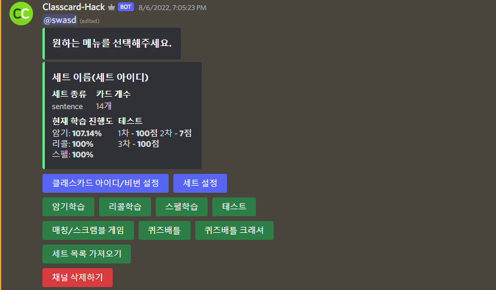

# 📗 Classcard Hack
언어:  
**:warning: 악용금지! 학습 목적으로만 사용해주세요.**

## 📙 설명
* 클래스카드 자동화

- [x] 암기 학습
- [x] 리콜 학습
- [x] 스펠 학습
- [x] 테스트
- [x] 매칭 게임
- [x] 스크램블 게임
- [x] 퀴즈배틀
 
**퀴즈 배틀 스크램블, 헌트는 지원하지 않습니다.**

## 📄 사용법
기본적으로 디스코드 봇 만드는 방법은 아실거라 생각합니다.
1. `yarn`을 실행합니다.
2. `yarn run compile`을 실행합니다.
3. `node index.js`를 실행 후 생성된 config.json 파일 수정합니다.
4. `node index.js`를 실행합니다.
5. 봇을 디스코드 서버에 초대합니다.
6. 디스코드 서버에서 `!setup`을 전송합니다.
7. `#사용`채널에서 버튼을 누르고 사용하시면 됩니다.

## 📸 사진
